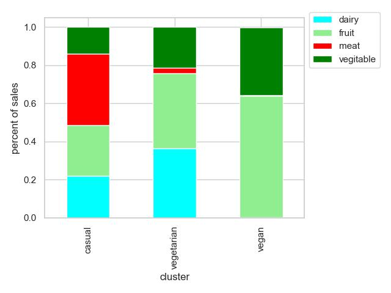

## We are what we eat - Segmenting customer based on food habits. 

### Objective: We like to see whether customers can be segmented based on the food item they purchase.

### ABC Grocery has collection of data on transaction details of customer's purchase on different food items like, Diary, Fruit, Meat, and Vegetables.  Data has come from two tables - product_area and transactions.

## transactions Table

| customer_id |  trasaction_date | transaction_id | product_area_id | num_items | sales_cost |
| ----        | ----             |-------------    | -------       | -------   | -------  |
|647          | 2020-04-01       | 4355233          |   4         | 3           |9.33      |
|647          | 2020-04-01       | 4355233          |   3         | 4           |23.82      |
|439          | 2020-07-15       | 4355500          |   4         | 1           |6.83      |
|439          | 2020-07-15       | 4355500          |   4         | 5           |9.44      |

## product_areas Table:
| product_area_id |  product_area_name | profit_margin |
|------------------| ------------------|----------------|
| 1                | Non-Food          | 0.25           |
| 2                | Vegetables         | 0.18           |
| 3                | Fruit              | 0.14           |
| 4                | Dairy              | 0.19           |
| 1                | Meat               | 0.11           |

## We find that 3 groups, *Casual* who eats meat, vegetables, fruit, and dairy products; *Vegertarian* with little meat and *Vegan* with no meat and dairy:

